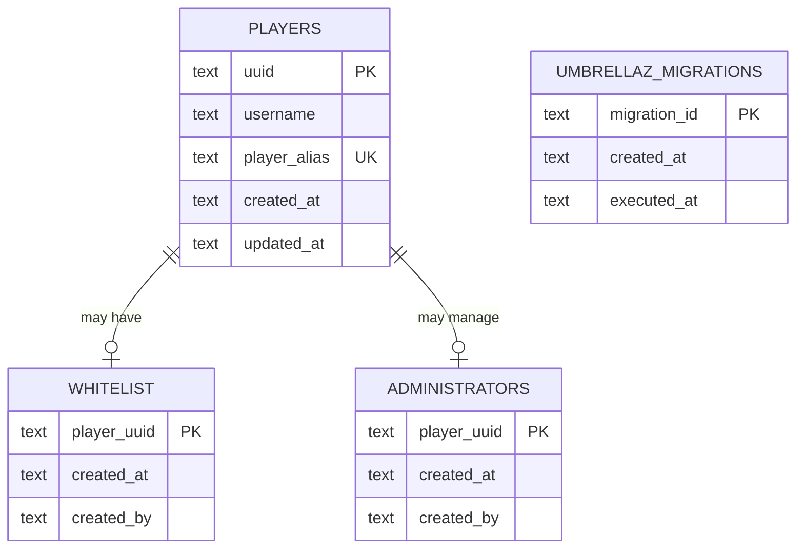

# Umbrellaz Architecture

## Overview

Umbrellaz is a modular server-side Fabric application embedded inside a Minecraft server.

The architecture is designed around three goals:

1. keep Minecraft integration at the edges
2. keep application behavior independent from infrastructure where practical
3. allow new administrative modules to be added without restructuring existing code

The project starts with:

```text
player
auth
whitelist
SQLite
commands
Fabric events
```

and is expected to expand later.

---

# High-Level Architecture

```text
                 Minecraft / Fabric
                        │
              ┌─────────┴─────────┐
              │                   │
           Commands             Events
              │                   │
              └─────────┬─────────┘
                        │
                        ▼
                Application Services
                        │
               ┌────────┴────────┐
               │                 │
             Cache          Repositories
                                 │
                                 ▼
                         DatabaseExecutor
                                 │
                                 ▼
                              SQLite
```

Minecraft integration stays at the outside.

Application behavior lives in services.

Persistence stays behind repositories and database infrastructure.

---

# Proposed Package Structure

```text
src/main/java/dev/chirana/umbrellaz/
├── Umbrellaz.java
│
├── auth/
│   ├── AuthSession.java
│   ├── AuthState.java
│   ├── AuthService.java
│   └── AuthEvents.java
│
├── whitelist/
│   ├── WhitelistEntry.java
│   ├── WhitelistRepository.java
│   ├── WhitelistService.java
│   └── WhitelistCommand.java
│
├── player/
│   ├── Player.java
│   ├── PlayerRepository.java
│   └── PlayerService.java
│
├── command/
│   ├── CommandModule.java
│   └── CommandRegistry.java
│
├── authorization/
│   └── AuthorizationService.java
│
├── config/
│   ├── UmbrellazConfig.java
│   └── ConfigLoader.java
│
└── infra/
    └── db/
        ├── Database.java
        ├── DatabaseExecutor.java
        ├── Migration.java
        ├── MigrationRunner.java
        └── sqlite/
            ├── SQLiteDatabase.java
            └── SQLiteConnectionFactory.java
```

This structure may evolve, but dependency direction must remain consistent.

---

# Composition Root

`Umbrellaz.java` is the application composition root.

Its responsibility is to create and connect the application's components.

Conceptually:

```text
Umbrellaz
   │
   ├── Config
   │
   ├── DatabaseExecutor
   │
   ├── Database
   │
   ├── MigrationRunner
   │
   ├── PlayerRepository
   │
   ├── WhitelistRepository
   │
   ├── PlayerService
   │
   ├── WhitelistService
   │
   ├── AuthService
   │
   ├── AuthorizationService
   │
   ├── Commands
   │
   └── Events
```

`Umbrellaz.java` must not contain business rules.

---

# Module Boundaries

## Player

The `player` module represents persistent Minecraft player identity.

Responsibilities:

- persist UUID
- store latest known username
- store one globally unique, case-insensitive alias per player
- retrieve player records
- update player metadata

It must not decide whether a player is authorized.

Conceptual model:

```text
Player
---------
uuid
username
alias
createdAt
updatedAt
```

---

# Whitelist

The whitelist module determines whether a player is eligible for access.

Responsibilities:

- add whitelist entry
- remove whitelist entry
- check whitelist status
- list entries
- maintain whitelist runtime cache

It does not own the player's current connected session.

Conceptually:

```text
Player
   │
   ▼
WhitelistEntry
```

Whitelist is persistent state.

---

# Auth

The auth module controls runtime authorization state for connected players.

Responsibilities:

- initialize blocked sessions
- evaluate authorization
- transition sessions
- answer whether a connected player may interact
- block/release players
- handle join/disconnect lifecycle

Auth depends on whitelist behavior.

Whitelist must not depend on auth internals.

Dependency:

```text
Auth
 ↓
Whitelist
```

not:

```text
Whitelist
 ↓
Auth
```

---

# Auth Session

Auth session is an in-memory representation of a connected player's current state.

Conceptual states:

```text
BLOCKED
AUTHENTICATED
```

Possible representation:

```text
AuthSession
----------------
playerUuid
state
authenticatedAt
```

The exact model may remain minimal initially.

---

# Authorization vs Authentication

These concepts must remain separate.

Authentication answers:

```text
May this connected player interact with the server?
```

Administrative authorization answers:

```text
May this player execute this administrative action?
```

Administrative authorization is controlled internally by the
`_umbrellaz_administrators` table and the player UUID. The server console is
the system bootstrap source; player command sources must be present in that
table to manage Umbrellaz administration.

The current command policy rejects every player-originated command from a
non-administrator, including an authenticated non-administrator. Umbrellaz
command adapters still perform their own administrator checks. Any future
exception must go through `AuthorizationService`; it must not weaken the
fail-closed policy.

This should be wrapped in:

```text
AuthorizationService
```

so future custom permissions can replace the implementation without rewriting commands.

---

# Future Permissions

Later architecture may introduce:

```text
roles/
permissions/
```

At that point:

```text
AuthorizationService
       ↓
PermissionService
```

Commands should not need architectural changes.

Commands must not inspect the administrator table or implement authorization
rules themselves. They use `AuthorizationService`.

---

# Command Architecture

All Umbrellaz commands share the root:

```text
/umbrellaz
```

Optional alias:

```text
/uz
```

Initial commands:

```text
/umbrellaz whitelist list
/umbrellaz whitelist add <player>
/umbrellaz whitelist remove <player>
/umbrellaz whitelist check <player>
```

Architecture:

```text
Brigadier
   ↓
WhitelistCommand
   ↓
AuthorizationService
   ↓
WhitelistService
```

The command adapter owns Minecraft-specific argument parsing and messaging.

The service owns the behavior.

---

# Command Module Registration

Command registration may use a lightweight module contract:

```text
CommandModule
```

Conceptually:

```java
interface CommandModule {
    void register(...);
}
```

Then:

```text
CommandRegistry
   ├── WhitelistCommand
   ├── future RolesCommand
   ├── future HomesCommand
   └── future BanCommand
```

Do not build a plugin system inside the mod yet.

This interface exists only to keep registration organized.

---

# Persistence Architecture

```text
Service
  ↓
DatabaseExecutor
  ↓
Repository
  ↓
SQLite
```

The repository itself may use blocking JDBC.

The executor boundary ensures JDBC runs outside the Minecraft thread.

Another acceptable implementation is:

```text
Service
  ↓
DatabaseExecutor.submit(
    repository operation
  )
```

The important architectural rule is the thread boundary, not a specific call syntax.

---

# Database Executor

Use a dedicated single-thread executor initially.

```text
Minecraft server thread
        │
        ▼
CompletableFuture
        │
        ▼
DatabaseExecutor
        │
        ▼
SQLite/JDBC
```

Reasons:

- low database workload
- SQLite serialization characteristics
- simple write ordering
- reduced locking complexity
- easier reasoning

Do not use the common `ForkJoinPool` for database operations.

The executor should have a descriptive thread name, such as:

```text
umbrellaz-db
```

---

# Returning to Minecraft

After database work:

```text
Database thread
      ↓
CompletableFuture
      ↓
server.execute(...)
      ↓
Minecraft server thread
```

Only the Minecraft server thread should perform authoritative world/player mutation.

---

# Database

Default location:

```text
config/umbrellaz/umbrellaz.db
```

SQLite configuration:

```sql
PRAGMA journal_mode=WAL;
PRAGMA foreign_keys=ON;
PRAGMA synchronous=NORMAL;
PRAGMA busy_timeout=5000;
```

---

# Database Schema

Initial conceptual schema:



UUID may be stored using a consistent textual representation initially.

Do not use username as a foreign key.

---

# Migrations

Schema management belongs to `MigrationRunner`.

Example migrations:

```text
20260926180100_create_players.sql
20260926180200_create_whitelist.sql
```

Startup:

```text
open database
    ↓
configure SQLite
    ↓
    discover `db/migrations/*.sql`
    ↓
    ensure `_umbrellaz_migrations` exists through the first migration
    ↓
    execute unapplied migrations in filename order
    ↓
    record migration id, creation time, and execution time
```

Repositories must assume the expected schema already exists.

---

# Cache Architecture

Whitelist:

```text
SQLite
  ↓
startup load
  ↓
Set<UUID>
```

Sessions:

```text
Player connection
      ↓
Map<UUID, AuthSession>
```

These structures serve different purposes.

Whitelist cache:

```text
persistent authorization eligibility
```

Session cache:

```text
current runtime connection state
```

---

# Startup Lifecycle

Desired startup order:

```text
1. initialize logger
2. load configuration
3. create DatabaseExecutor
4. open/configure SQLite
5. execute migrations
6. create repositories
7. create services
8. load whitelist cache
9. load player alias cache
10. register commands
11. register events
12. mark Umbrellaz ready
```

Authorization must fail closed while startup state is incomplete.

---

# Shutdown Lifecycle

Desired shutdown:

```text
1. stop accepting new database work where practical
2. complete queued critical operations
3. close SQLite resources
4. shutdown DatabaseExecutor
```

The application must not leak non-daemon executor threads that prevent server shutdown.

---

# Player Join Flow

```text
Player joins
    ↓
Create AuthSession(BLOCKED)
    ↓
Create/update player record async
    ↓
Resolve whitelist state
    ↓
Is UUID whitelisted?
   ┌───────┴────────┐
   │                │
  yes               no
   │                │
   ▼                ▼
server.execute   server.execute
   │                │
   ▼                ▼
AUTHENTICATED      BLOCKED
```

The player starts blocked.

There is no temporary unrestricted state while SQLite is queried.

---

# Blocked Player Flow

```text
Blocked Player
     │
     ├── movement check
     ├── break check
     ├── place check
     ├── attack check
     ├── interaction check
     ├── item check
     ├── command check
     └── inventory-related check
             │
             ▼
       AuthService / cache
             │
             ▼
          BLOCKED
             │
             ▼
      cancel operation
```

These checks must never access SQLite.

Some packet paths do not expose cancellable Fabric events. Those paths are
handled by narrow server-side mixin adapters under `mixin/`. Mixins may read
the runtime authorization state through the auth adapter, but must not perform
database work or contain authorization rules.

The command source adapter also grants the effective Vanilla command level to
an Umbrellaz administrator. This only changes command execution for UUIDs in
`_umbrellaz_administrators`; it does not use Vanilla operator state as the
application authorization source.

---

# Restricted Spawn

Blocked players are kept at a restricted location.

Configuration should eventually support:

```text
world
x
y
z
yaw
pitch
```

Architecturally:

```text
UmbrellazConfig
      ↓
AuthService
      ↓
Minecraft adapter/event
```

Domain persistence does not need to know about Minecraft positions.

---

# Whitelist Add Flow

```text
Admin command
      ↓
AuthorizationService
      ↓
WhitelistService
      ↓
resolve player identity
      ↓
DatabaseExecutor
      ↓
WhitelistRepository
      ↓
SQLite
      ↓
success
      ↓
update whitelist cache
      ↓
player online?
   ┌──────┴───────┐
  yes             no
   │               │
   ▼               ▼
AuthService       done
   ↓
server.execute(...)
   ↓
AUTHENTICATED
```

The player should not need to reconnect after being added.

---

# Whitelist Remove Flow

```text
Admin command
      ↓
AuthorizationService
      ↓
WhitelistService
      ↓
DatabaseExecutor
      ↓
WhitelistRepository
      ↓
SQLite
      ↓
success
      ↓
remove from cache
      ↓
player online?
   ┌──────┴───────┐
  yes             no
   │               │
   ▼               ▼
AuthService       done
   ↓
BLOCKED
   ↓
server.execute(...)
   ↓
restricted spawn
```

Removal must take effect immediately.

---

# Player Resolution

Whitelist commands should operate on identity rather than requiring an online `ServerPlayer`.

Preferred conceptual service:

```text
PlayerService
```

Responsibilities may include:

- lookup known player by UUID
- lookup known player by stored username
- update username when player joins
- resolve an alias before a stored username

External Mojang lookups are not part of the initial architecture.

All identifier resolution uses an explicit result: found, not found, ambiguous,
or not ready. Alias and stored/current username matches are combined before a
player is selected; a collision never falls back to an arbitrary match. Online
commands use a shared resolver backed by the in-memory alias cache and fail
closed until that cache has loaded successfully. The resolver never queries
SQLite on a command hot path; alias mutations update the cache only after
persistence succeeds.

---

# Error Flow

Example DB failure during authentication:

```text
Player join
   ↓
DB lookup
   ↓
failure
   ↓
log error
   ↓
BLOCKED
```

Example DB failure during whitelist add:

```text
Admin command
   ↓
DB write
   ↓
failure
   ↓
do not update cache
   ↓
report failure
```

Persistence state must not diverge intentionally from runtime state.

---

# Thread Ownership

## Minecraft thread owns

- world changes
- entity changes
- player movement
- teleportation
- messaging
- command-side Minecraft state
- inventory mutation
- server APIs requiring main-thread access

## Database thread owns

- JDBC calls
- migrations
- SQL reads
- SQL writes
- transactions

## Concurrent runtime structures

Caches accessed by multiple threads must use an appropriate concurrency strategy.

Do not add synchronization blindly.

Prefer explicit ownership where possible.

---

# Module Dependency Guidelines

Allowed:

```text
auth → whitelist
auth → player
whitelist → player
application modules → infra abstractions
commands → application services
events → application services
```

Avoid:

```text
infra → commands
infra → Fabric events
repository → auth command
player → whitelist command
whitelist → Minecraft UI
```

Infrastructure must remain reusable by modules.

---

# Future Module Pattern

Future feature example:

```text
homes/
├── Home.java
├── HomeRepository.java
├── HomeService.java
└── HomeCommand.java
```

Flow:

```text
HomeCommand
    ↓
HomeService
    ↓
HomeRepository
    ↓
DatabaseExecutor
    ↓
SQLite
```

This same pattern should support:

```text
roles
permissions
homes
teleport
bans
mutes
economy
```

without requiring architectural redesign.

---

# GUI Future

A future GUI may exist, but it must remain an adapter.

Conceptually:

```text
Client GUI
    ↓
network message
    ↓
server adapter
    ↓
AuthorizationService
    ↓
Application Service
```

The GUI must never become an authorization source.

All decisions remain server-side.

No GUI implementation belongs in the current scope.

---

# HTTP / Web

There is currently no HTTP server or web interface.

Do not add one without an explicit architectural decision.

The current management surface is Minecraft commands.

---

# Native Minecraft Whitelist

Umbrellaz does not use Minecraft's native whitelist as its primary application state.

The Umbrellaz whitelist exists in SQLite.

This decision allows future additions such as:

- expiration
- invitations
- roles
- metadata
- audit trails
- custom admission policies

---

# Architectural Non-Goals

The project is not currently trying to become:

- a distributed system
- a microservice architecture
- a generic plugin framework
- an ORM-based application
- a reactive system
- a client/server GUI framework
- an HTTP administration platform

Do not solve problems the project does not yet have.

---

# Architecture Evolution Rule

Architecture should evolve because requirements demand it.

Before adding:

```text
new abstraction
new shared layer
new executor
new database
new framework
new generic interface
```

there should be a concrete requirement.

Prefer the smallest structure that preserves the boundaries defined in this document.
