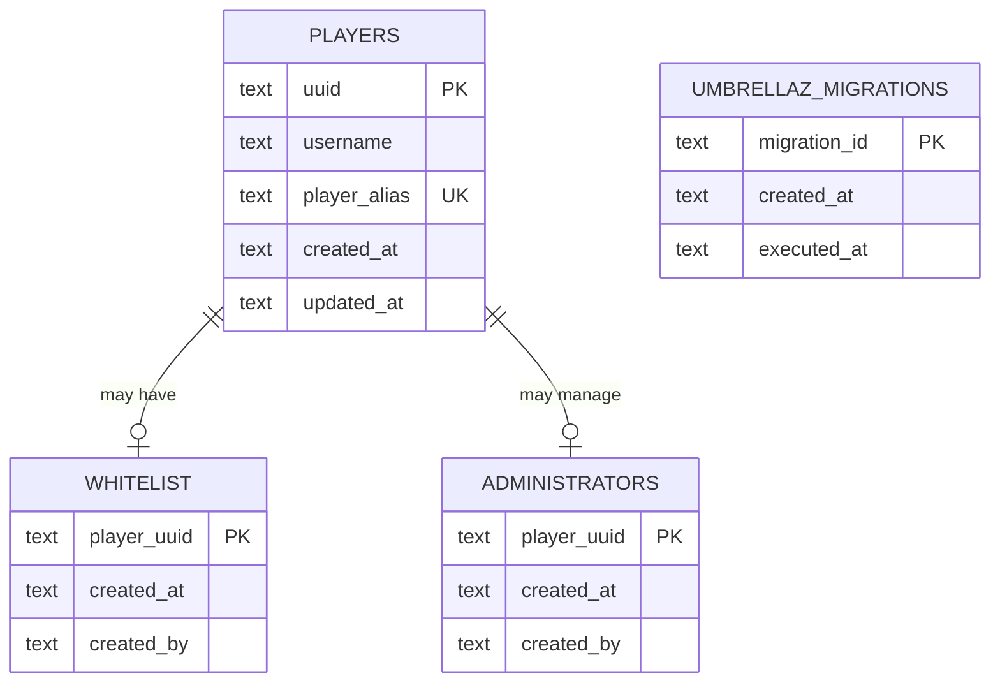

# Umbrellaz Architecture

## Overview

Umbrellaz is a modular, server-authoritative Fabric application delivered as one
universal client/server mod JAR and embedded inside Minecraft. Common/server
behavior remains authoritative; the client source set supplies the custom GUI
adapter.

The architecture is designed around three goals:

1. keep Minecraft integration at the edges
2. keep application behavior independent from infrastructure where practical
3. allow new administrative modules to be added without restructuring existing code
4. keep client presentation separate from server-owned state and decisions

The project starts with:

```text
player
auth
whitelist
SQLite
commands
Fabric events
```

and is expected to expand later.

---

# High-Level Architecture

```text
                 Minecraft / Fabric
                        │
              ┌─────────┴─────────┐
              │                   │
           Commands             Events
              │                   │
              └─────────┬─────────┘
                        │
                        ▼
                Application Services
                        │
               ┌────────┴────────┐
               │                 │
             Cache          Repositories
                                 │
                                 ▼
                         DatabaseExecutor
                                 │
                                 ▼
                              SQLite
```

Minecraft integration stays at the outside.

Application behavior lives in services.

Persistence stays behind repositories and database infrastructure.

---

# Proposed Package Structure

```text
src/main/java/dev/chirana/umbrellaz/
├── Umbrellaz.java
│
├── auth/
│   ├── AuthSession.java
│   ├── AuthState.java
│   ├── AuthService.java
│   └── AuthEvents.java
│
├── whitelist/
│   ├── WhitelistEntry.java
│   ├── WhitelistRepository.java
│   ├── WhitelistService.java
│   └── WhitelistCommand.java
│
├── player/
│   ├── Player.java
│   ├── PlayerRepository.java
│   └── PlayerService.java

├── lock/
│   ├── LockService.java
│   ├── LockRepository.java
│   ├── LockCache.java
│   ├── PlacementProvenance.java
│   └── PasswordKdf.java
│
├── command/
│   ├── CommandModule.java
│   └── CommandRegistry.java
│
├── authorization/
│   └── AuthorizationService.java
│
├── config/
│   ├── UmbrellazConfig.java
│   └── ConfigLoader.java
│
    └── infra/
        └── db/
        ├── Database.java
        ├── DatabaseExecutor.java
        ├── Migration.java
        ├── MigrationRunner.java
        └── sqlite/
            ├── SQLiteDatabase.java
            └── SQLiteConnectionFactory.java

src/client/java/dev/chirana/umbrellaz/
└── client/
    └── ... client entrypoint, screens, rendering, and input ...
```

This structure may evolve, but dependency direction must remain consistent.

`src/main/java` is common/server code and must not import or load
`net.minecraft.client`. Client rendering, focus, and input belong under
`src/client/java` behind a separate client entrypoint. Shared protocol payloads,
codecs, version constants, and capability contracts must remain
client/server-neutral so both environments can load them.

---

# Composition Root and Server Lifecycle

The common `Umbrellaz.java` initializer is environment-safe and
registration-only. Fabric callbacks and payload registrations are global and
are installed exactly once. They must not register `LockEvents` or capture
server-owned services per server lifecycle. They register resolvers that, at
invocation time, select the runtime associated with the event's
`MinecraftServer` or connection. If no matching ready runtime exists, the
callback fails closed. The initializer does not construct server-owned
databases, executors, repositories, services, caches, command modules, or other
runtime state and must not load client classes.

A per-server runtime composition root/factory creates and connects the
application's databases, executor, repositories, services, caches, command
adapters, and protocol/runtime state for each server lifecycle:

```text
Server lifecycle start
   ↓
Config → DatabaseExecutor → Database/Migrations
                         ↓
              Repositories → Services → Caches
                                      ↓
                         Commands, Events, Protocol
```

The runtime owns those components, connection-scoped protocol sessions, and
pending action contexts. Shutdown closes pending work and all resources for that
server instance. Before shutdown, it marks the
runtime unavailable and removes its registry association so callbacks cannot
resolve it. A subsequent integrated-server restart constructs a fresh runtime;
no database executor, service, protocol session, or server reference may leak
across instances. The initializer and runtime composition must not contain
business rules.

---

# Module Boundaries

## Player

The `player` module represents persistent Minecraft player identity.

Responsibilities:

- persist UUID
- store latest known username
- store one globally unique, case-insensitive alias per player
- retrieve player records
- update player metadata

It must not decide whether a player is authorized.

Conceptual model:

```text
Player
---------
uuid
username
alias
createdAt
updatedAt
```

---

# Whitelist

The whitelist module determines whether a player is eligible for access.

Responsibilities:

- add whitelist entry
- remove whitelist entry
- check whitelist status
- list entries
- maintain whitelist runtime cache

It does not own the player's current connected session.

Conceptually:

```text
Player
   │
   ▼
WhitelistEntry
```

Whitelist is persistent state.

---

# Auth

The auth module controls runtime authorization state for connected players.

Responsibilities:

- initialize blocked sessions
- evaluate authorization
- transition sessions
- answer whether a connected player may interact
- block/release players
- handle join/disconnect lifecycle

Auth depends on whitelist behavior.

Whitelist must not depend on auth internals.

Dependency:

```text
Auth
 ↓
Whitelist
```

not:

```text
Whitelist
 ↓
Auth
```

---

# Auth Session

Auth session is an in-memory representation of a connected player's current state.

Conceptual states:

```text
BLOCKED
AUTHENTICATED
```

Possible representation:

```text
AuthSession
----------------
playerUuid
state
authenticatedAt
```

The exact model may remain minimal initially.

---

# Authorization vs Authentication

These concepts must remain separate.

Authentication answers:

```text
May this connected player interact with the server?
```

Administrative authorization answers:

```text
May this player execute this administrative action?
```

Administrative authorization is controlled internally by the
`_umbrellaz_administrators` table and the player UUID. The server console is
the system bootstrap source; player command sources must be present in that
table to manage Umbrellaz administration.

The current command policy rejects every player-originated command from a
non-administrator, including an authenticated non-administrator. Umbrellaz
command adapters still perform their own administrator checks. Any future
exception must go through `AuthorizationService`; it must not weaken the
fail-closed policy.

This should be wrapped in:

```text
AuthorizationService
```

so future custom permissions can replace the implementation without rewriting commands.

---

# Future Permissions

Later architecture may introduce:

```text
roles/
permissions/
```

At that point:

```text
AuthorizationService
       ↓
PermissionService
```

Commands should not need architectural changes.

Commands must not inspect the administrator table or implement authorization
rules themselves. They use `AuthorizationService`.

---

# Command Architecture

All Umbrellaz commands share the root:

```text
/umbrellaz
```

Optional alias:

```text
/uz
```

Initial commands:

```text
/umbrellaz whitelist list
/umbrellaz whitelist add <player>
/umbrellaz whitelist remove <player>
/umbrellaz whitelist check <player>
```

Architecture:

```text
Brigadier
   ↓
WhitelistCommand
   ↓
AuthorizationService
   ↓
WhitelistService
```

The command adapter owns Minecraft-specific argument parsing and messaging.

The service owns the behavior.

---

# Command Module Registration

Command registration may use a lightweight module contract:

```text
CommandModule
```

Conceptually:

```java
interface CommandModule {
    void register(...);
}
```

Then:

```text
CommandRegistry
   ├── WhitelistCommand
   ├── future RolesCommand
   ├── future HomesCommand
   └── future BanCommand
```

Do not build a plugin system inside the mod yet.

This interface exists only to keep registration organized.

---

# Persistence Architecture

```text
Service
  ↓
DatabaseExecutor
  ↓
Repository
  ↓
SQLite
```

The repository itself may use blocking JDBC.

The executor boundary ensures JDBC runs outside the Minecraft thread.

Another acceptable implementation is:

```text
Service
  ↓
DatabaseExecutor.submit(
    repository operation
  )
```

The important architectural rule is the thread boundary, not a specific call syntax.

---

# Database Executor

Use a dedicated single-thread executor initially.

```text
Minecraft server thread
        │
        ▼
CompletableFuture
        │
        ▼
DatabaseExecutor
        │
        ▼
SQLite/JDBC
```

Reasons:

- low database workload
- SQLite serialization characteristics
- simple write ordering
- reduced locking complexity
- easier reasoning

Do not use the common `ForkJoinPool` for database operations.

The executor should have a descriptive thread name, such as:

```text
umbrellaz-db
```

---

# Returning to Minecraft

After database work:

```text
Database thread
      ↓
CompletableFuture
      ↓
server.execute(...)
      ↓
Minecraft server thread
```

Only the Minecraft server thread should perform authoritative world/player mutation.

---

# Custom GUI Packaging and Protocol

The build delivers one universal Fabric mod JAR with common/server
code, a split client source set, and separate `main` and `client` entrypoints.
The exact Minecraft/Fabric compatibility declared by the artifact is required.
The same `umbrellaz-mod-<version>.jar` is installed as the mod in both client and
server `mods` directories. It bundles the lock item model and texture, so no
separate resource pack or resource-pack URL, SHA-1, or server configuration is
required. For TLauncher, install the matching universal JAR in the client
`mods` directory; the authenticated-session requirement remains unchanged.

The Minecraft 26.3 lane uses Fabric Loom `net.fabricmc.fabric-loom` 1.17.21
with the non-obfuscated runtime namespace; it does not use
`officialMojangMappings()` or require a remapping task. `releaseArtifact` uses
the normal production `jar` output; release depends on and builds, validates, and
uploads only that universal JAR.

GUI networking uses typed `CustomPacketPayload` and `StreamCodec` contracts.
Every payload is versioned, bounded, and validated; codecs must reject
oversized, malformed, or unsupported data without allocating unbounded state.
The application performs an explicit hello/capability exchange because Fabric
payload registration is not a capability handshake. Each connection has one
protocol state:

```text
UNNEGOTIATED → COMPATIBLE
UNNEGOTIATED → INCOMPATIBLE → DISCONNECTED
UNNEGOTIATED → DISCONNECTED
```

`UNNEGOTIATED` is fail-closed during the handshake window: even when normal
whitelist/authentication has completed, the player remains interaction-blocked
until the state is `COMPATIBLE`. Absent, timed-out, or incompatible clients are
disconnected after the bounded handshake deadline. Timeout, incompatible
response, disconnect, and handshake failure cancel the deadline and session,
then disconnect on the server thread; no blocking wait is permitted. No vanilla
GUI fallback is permitted.

A connection-scoped nonce and generation bind requests to the physical
connection/session. Action contexts are server-issued, one-shot, and expiring.
Their token must atomically transition `OPEN → IN_FLIGHT` before KDF, database,
reservation, or world work; only the winner dispatches. Completion and
cancellation are terminal and idempotent. Each context binds the physical
connection/session, player UUID, negotiated nonce/generation, server-selected
action and target generations, and expiry. Disconnect or runtime shutdown
invalidates contexts; retries receive fresh tokens.

Capability is not authorization. For every action, the server validates the
authenticated session, negotiated capability, feature state, nonce/context or
token, target identity and bounds, and application authorization before calling
existing services. The client owns only rendering, focus, transient UI state,
and request input. The server owns identity, authentication, locks, target
resolution, tokens, KDF work, persistence, item accounting, world mutation, and
final results. JDBC remains behind `DatabaseExecutor`, and server state changes
return to the server thread after asynchronous work.

Custom client `Screen` and bundled item assets are presentation adapters, not
the vanilla GUI flow. The current Anvil adapter remains only until lock
migration; its existing server-authoritative reservation, cancellation,
fail-closed behavior, password policy, and exact item accounting must be
preserved during the transition.

---

# GUI Delivery Gates

Phase 2 foundation work uses the normal production `jar` output for
`releaseArtifact` and performs the first production universal-JAR inspection
after split-source-set and metadata wiring. Gate 2 inspects the expanded
`fabric.mod.json`, environment `*`, `main` and `client` entrypoints, client
classes/resources, mixin configuration, and the included SQLite dependency.
The 26.3 non-obfuscated lane uses the runtime namespace directly; no remapping
task is required.

Phase 5 repeats release/artifact validation for the final universal JAR, including
its client classes and bundled lock item assets. It is not the first proof of
packaging correctness.

---

# Database

Default location:

```text
config/umbrellaz/umbrellaz.db
```

SQLite configuration:

```sql
PRAGMA journal_mode=WAL;
PRAGMA foreign_keys=ON;
PRAGMA synchronous=NORMAL;
PRAGMA busy_timeout=5000;
```

---

# Database Schema

Initial conceptual schema:



UUID may be stored using a consistent textual representation initially.

Do not use username as a foreign key.

The feature-first `lock` module persists `lockers`, `locker_members`, and
`lock_placements`. A placement has a world, dimension, block position, UUID
generation, installer UUID, and expected block type. Locker members retain that
generation and expected provenance, so a replacement block cannot inherit a
previous lock. Locker owners remain UUID foreign keys to `players.uuid`.

---

# Migrations

Schema management belongs to `MigrationRunner`.

Example migrations:

```text
20260926180100_create_players.sql
20260926180200_create_whitelist.sql
```

Startup:

```text
open database
    ↓
configure SQLite
    ↓
    discover `db/migrations/*.sql`
    ↓
    ensure `_umbrellaz_migrations` exists through the first migration
    ↓
    execute unapplied migrations in filename order
    ↓
    record migration id, creation time, and execution time
```

Repositories must assume the expected schema already exists.

---

# Cache Architecture

Lock state follows a fail-closed lifecycle:

```text
DatabaseExecutor
      ↓
complete locker snapshot
      ↓
atomic LockCache publication
      ↓
ready hot-path lookup
```

The lock cache is explicitly not-ready before loading and remains not-ready if
database loading, row mapping, or duplicate-target validation fails. A lock
adapter must distinguish not-ready from an unlocked target and must never query
SQLite on the hot path.

Lock password verification and password creation use the lock service's bounded
KDF executor. The executor is owned by the service in the default composition,
is shut down with the service, and returns an explicit busy result (or failed
future for password creation) when saturated. KDF work must never run on the
Minecraft/server thread. After an asynchronous result requires Minecraft state
changes, the adapter must hand off with `server.execute(...)`.

An explicit password confirmation records at most three consecutive failures
for a player and locker, then applies a 30-second monotonic cooldown. Cooldown
state survives disconnect and is cleared only by successful confirmation or
server restart. A successful password confirmation grants that player OPEN,
BREAK, and REMOVE access until disconnect; there is no global unlocked state.

Lock placement provenance is loaded into a dedicated in-memory snapshot through
`DatabaseExecutor` during startup. The snapshot is not-ready until the load
completes, so an unknown placement fails closed. Ordinary successful placements
are persisted asynchronously and update only the affected lock-cache state;
they do not reload every locker on the interaction path.

World identity is a UUID stored in the world's `SavedDataStorage`, shared by
all dimensions and combined with the dimension identifier for lock targets.
There is no save-path or seed fallback: if the world-instance identity cannot
be initialized, lock placement and interaction adapters fail closed.

The vanilla Anvil adapter reserves one real marked lock item on the server
thread before starting KDF work. A failed or stale asynchronous operation
restores or drops exactly that item; a committed stale creation is compensated
transactionally before restoration. Completion handlers resolve the active
player session and use `server.execute(...)` before any menu, message,
inventory, or world mutation. Menu contexts validate player session, level,
target generations/topology, and conservative interaction range.

The interaction adapter uses Minecraft's authoritative
`isWithinBlockInteractionRange(..., 1.0D)` check. The second argument is
vanilla's additional margin; the player's `blockInteractionRange()` is the
authoritative base range and must not be passed as that margin. Every tracked
storage break, including an unlocked or not-yet-persisted placement, first
revalidates the session, generation, topology, and range on the server thread,
reserves a generation-specific pending-break token, and attempts the physical
destruction. Only a confirmed `destroyBlock == true` queues exact-generation
invalidation on the single `DatabaseExecutor`. Failed or stale destruction
leaves the database, cache, and placement tracker unchanged. After physical
destruction, the token remains fail-closed until invalidation completes; an
invalidation failure does not expose an unlocked target.

Disconnect and server-stop paths cancel all pending item reservations before
service shutdown. Reserved items are restored or dropped exactly once; any
locker transaction already queued or committed is compensated through the
still-open database executor without using a stale player reference.

Normal sneak-right-click removal deletes only the logical locker and preserves
all placement provenance. Actual block destruction invalidates the captured
generation and logical locker in one transaction after the world mutation,
preserves provenance for surviving members, and retains the pending token until
that invalidation commits. Double-chest contexts are canonicalized across both
horizontal members while retaining the clicked position for vanilla opening or destruction.
Placement adapters reject a new chest merge with any cached locked member.

Environmental protection is a hot-path lock adapter. Explosion, piston, fire,
and fluid integrations consult the in-memory cache only; they never query
SQLite. Supported storage positions fail closed while the world identity,
placement snapshot, or lock cache is not ready. Hoppers and inventory
automation are not intercepted. Marker entities are visual projections only:
an `ItemDisplay` carries a marked `LockItem`, a namespaced marker tag, and the
locker UUID, while the cache and SQLite remain authoritative. Marker
reconciliation runs on server/world and loaded-chunk lifecycle callbacks and
removes stale or duplicate projections.

The lock item's modern 26.3 model selector and texture are bundled at their
normal `assets/` paths in the universal mod JAR. The same JAR is installed on
the client and server, so Umbrellaz does not generate, require, serve, or
configure a separate resource pack, URL, SHA-1, or required-resource-pack flag.

Whitelist:

```text
SQLite
  ↓
startup load
  ↓
Set<UUID>
```

Sessions:

```text
Player connection
      ↓
Map<UUID, AuthSession>
```

These structures serve different purposes.

Whitelist cache:

```text
persistent authorization eligibility
```

Session cache:

```text
current runtime connection state
```

---

# Startup Lifecycle

Desired startup order:

```text
1. initialize logger
2. load configuration
3. create DatabaseExecutor
4. open/configure SQLite
5. execute migrations
6. create repositories
7. create services
8. load whitelist cache
9. load player alias cache
10. verify global command/event/payload registrations were installed exactly
    once by the common initializer
11. attach this server to the runtime registry
12. mark this runtime ready
```

Authorization must fail closed while startup state is incomplete.

---

# Shutdown Lifecycle

Desired shutdown:

```text
1. mark runtime unavailable and remove its registry association
2. invalidate connection sessions and action contexts
3. stop accepting new database work where practical
4. complete queued critical operations
5. close SQLite resources
6. shutdown DatabaseExecutor
```

The application must not leak non-daemon executor threads that prevent server shutdown.

---

# Player Join Flow

```text
Player joins
    ↓
Create AuthSession(BLOCKED)
    ↓
Create/update player record async
    ↓
Resolve whitelist state
    ↓
Is UUID whitelisted?
   ┌───────┴────────┐
   │                │
  yes               no
   │                │
   ▼                ▼
server.execute   server.execute
   │                │
   ▼                ▼
AUTHENTICATED      BLOCKED
```

The player starts blocked.

There is no temporary unrestricted state while SQLite is queried.

---

# Blocked Player Flow

```text
Blocked Player
     │
     ├── movement check
     ├── break check
     ├── place check
     ├── attack check
     ├── interaction check
     ├── item check
     ├── command check
     └── inventory-related check
             │
             ▼
       AuthService / cache
             │
             ▼
          BLOCKED
             │
             ▼
      cancel operation
```

These checks must never access SQLite.

Some packet paths do not expose cancellable Fabric events. Those paths are
handled by narrow server-side mixin adapters under `mixin/`. Mixins may read
the runtime authorization state through the auth adapter, but must not perform
database work or contain authorization rules.

The command source adapter also grants the effective Vanilla command level to
an Umbrellaz administrator. This only changes command execution for UUIDs in
`_umbrellaz_administrators`; it does not use Vanilla operator state as the
application authorization source.

---

# Restricted Spawn

Blocked players are kept at a restricted location.

Configuration should eventually support:

```text
world
x
y
z
yaw
pitch
```

Architecturally:

```text
UmbrellazConfig
      ↓
AuthService
      ↓
Minecraft adapter/event
```

Domain persistence does not need to know about Minecraft positions.

---

# Whitelist Add Flow

```text
Admin command
      ↓
AuthorizationService
      ↓
WhitelistService
      ↓
resolve player identity
      ↓
DatabaseExecutor
      ↓
WhitelistRepository
      ↓
SQLite
      ↓
success
      ↓
update whitelist cache
      ↓
player online?
   ┌──────┴───────┐
  yes             no
   │               │
   ▼               ▼
AuthService       done
   ↓
server.execute(...)
   ↓
AUTHENTICATED
```

The player should not need to reconnect after being added.

---

# Whitelist Remove Flow

```text
Admin command
      ↓
AuthorizationService
      ↓
WhitelistService
      ↓
DatabaseExecutor
      ↓
WhitelistRepository
      ↓
SQLite
      ↓
success
      ↓
remove from cache
      ↓
player online?
   ┌──────┴───────┐
  yes             no
   │               │
   ▼               ▼
AuthService       done
   ↓
BLOCKED
   ↓
server.execute(...)
   ↓
restricted spawn
```

Removal must take effect immediately.

---

# Player Resolution

Whitelist commands should operate on identity rather than requiring an online `ServerPlayer`.

Preferred conceptual service:

```text
PlayerService
```

Responsibilities may include:

- lookup known player by UUID
- lookup known player by stored username
- update username when player joins
- resolve an alias before a stored username

External Mojang lookups are not part of the initial architecture.

All identifier resolution uses an explicit result: found, not found, ambiguous,
or not ready. Alias and stored/current username matches are combined before a
player is selected; a collision never falls back to an arbitrary match. Online
commands use a shared resolver backed by the in-memory alias cache and fail
closed until that cache has loaded successfully. The resolver never queries
SQLite on a command hot path; alias mutations update the cache only after
persistence succeeds.

---

# Error Flow

Example DB failure during authentication:

```text
Player join
   ↓
DB lookup
   ↓
failure
   ↓
log error
   ↓
BLOCKED
```

Example DB failure during whitelist add:

```text
Admin command
   ↓
DB write
   ↓
failure
   ↓
do not update cache
   ↓
report failure
```

Persistence state must not diverge intentionally from runtime state.

---

# Thread Ownership

## Minecraft thread owns

- world changes
- entity changes
- player movement
- teleportation
- messaging
- command-side Minecraft state
- inventory mutation
- server APIs requiring main-thread access

## Database thread owns

- JDBC calls
- migrations
- SQL reads
- SQL writes
- transactions

## Concurrent runtime structures

Caches accessed by multiple threads must use an appropriate concurrency strategy.

Do not add synchronization blindly.

Prefer explicit ownership where possible.

---

# Module Dependency Guidelines

Allowed:

```text
auth → whitelist
auth → player
whitelist → player
application modules → infra abstractions
commands → application services
events → application services
```

Avoid:

```text
infra → commands
infra → Fabric events
repository → auth command
player → whitelist command
whitelist → Minecraft UI
```

Infrastructure must remain reusable by modules.

---

# Future Module Pattern

Future feature example:

```text
homes/
├── Home.java
├── HomeRepository.java
├── HomeService.java
└── HomeCommand.java
```

Flow:

```text
HomeCommand
    ↓
HomeService
    ↓
HomeRepository
    ↓
DatabaseExecutor
    ↓
SQLite
```

This same pattern should support:

```text
roles
permissions
homes
teleport
bans
mutes
economy
```

without requiring architectural redesign.

---

# GUI Adapter

The custom GUI is a client presentation adapter, not an authorization source.

Conceptually:

```text
Client Screen/input
    ↓ typed bounded payload
server protocol adapter
    ↓ authenticated session + capability/token validation
AuthorizationService / lock service
    ↓
server result payload
```

All identity, authorization, lock state, password validation, persistence,
item accounting, world mutation, and final decisions remain server-side. The
client may render only server-provided state and submit request input; it must
not be trusted for button identifiers, target identity, permissions, password
policy, or completion claims.

The custom Screen and bundled item assets are not a vanilla GUI fallback. The
current vanilla Anvil input flow remains only until lock migration, and its
server-authoritative behavior, item reservation/compensation, stale-operation
handling, and rejection of movement, shift-click, drag, swap, and duplication
paths must remain intact until then.

---

# HTTP / Web

There is currently no HTTP server or web interface.

Do not add one without an explicit architectural decision.

The current management surface is Minecraft commands.

---

# Native Minecraft Whitelist

Umbrellaz does not use Minecraft's native whitelist as its primary application state.

The Umbrellaz whitelist exists in SQLite.

This decision allows future additions such as:

- expiration
- invitations
- roles
- metadata
- audit trails
- custom admission policies

---

# Architectural Non-Goals

The project is not currently trying to become:

- a distributed system
- a microservice architecture
- a generic plugin framework
- an ORM-based application
- a reactive system
- a generic client/server GUI framework beyond the required Umbrellaz screens
- an HTTP administration platform

Do not solve problems the project does not yet have.

---

# Architecture Evolution Rule

Architecture should evolve because requirements demand it.

Before adding:

```text
new abstraction
new shared layer
new executor
new database
new framework
new generic interface
```

there should be a concrete requirement.

Prefer the smallest structure that preserves the boundaries defined in this document.
